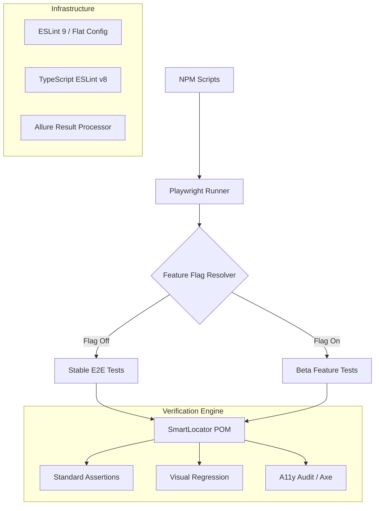

# Playwright Trunk Based Development Demo



Advanced Playwright (TypeScript) automation showcasing Trunk Based Development (TBD) and high-coverage engineering standards.

## 🎯 Testing Coverage
- **E2E Automation**: Full coverage for Saucedemo (Auth/Checkout) and YouTube.com (Search/Results).
- **Unit Testing (Jest)**: Fast feedback for core logic like Feature Toggle resolution.
- **Visual Testing**: Baseline-vs-Checkpoint pixel comparison for critical UI states.
- **Accessibility (A11y)**: Automatic WCAG 2.1 AA audits integrated into the spec runners via `axe-core`.
- **Experimental**: YouTube Shorts and experimental UI path verification.

## 🛠 Engineering Standards
- **Trunk Based Development**: Uses `FeatureToggle.ts` to coordinate releases from `main`, enabling dark launches and conditional tests.
- **Auto-Healing**: Powered by `SmartLocator.ts` for dynamic recovery from UI shifts.
- **Localization (Chapter 14)**:
    - Integrated `PseudoLocalizer` for testing text expansion and Unicode stability.
    - Automated verification of UI resilience with pseudo-localized strings.
- **Modern Tooling**:
    - **ESLint 9 (Flat Config)**: Migrated to `eslint.config.mjs` for future-proof linting.
    - **TypeScript ESLint v8**: Optimized for the latest TS features.

## 🚀 Getting Started
```bash
npm install
npx playwright install
```

## 🏃 Execution Commands
```bash
# Unit Tests
npm run test:unit

# Standard E2E
npm run test:e2e

# Feature Preview (Flags Enabled)
npm run test:feature

# Linting Check (ESLint 9)
npm run lint

# Visual & A11y Audit
npx playwright test visual_a11y.spec.ts
```

## 📊 Reporting
Comprehensive **Allure Reporting** with trends, screenshots, and video traces.
```bash
npm run test:report
# Or manually
npx allure generate allure-results --clean -o allure-report && npx allure open allure-report
```

## 📂 Architecture
- `src/pages/`: Standard and Smart-Locator POMs.
- `tests/e2e/`: Feature-flagged and experimental test suites.
- `.github/workflows/`: Optimized CI pipeline with Allure artifact hosting.
